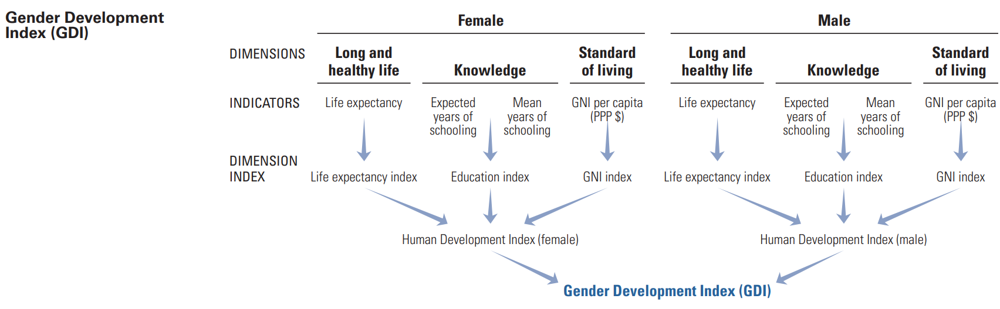

# Gender Gap in Education

**Knowledge** is one of the major dimensions taken into account in the [*Human Development Report*](http://hdr.undp.org/sites/default/files/hdr2019.pdf) published by the United Nations when quantifying the *Gender Development Index (GDI)*.



In order to visualize the the **evolution of the gender gap in education**, the [*Institute for Health Metrics and Evaluation*](http://ghdx.healthdata.org/record/ihme-data/global-educational-attainment-1970-2015) provides estimates of average years of educational attainment per capita (including primary, secondary and tertiary education) for people over the age of 15 for the years 1970-2015 by year, sex, and age group for 188 countries.

Moreover, inspired by [*Gapminder*](https://www.gapminder.org/) we incorporate the following indicators:

- **Income per person**: Extracted from the [*World Bank Open Data*](https://data.worldbank.org/indicator/NY.GDP.PCAP.KDl), GDP per capita is gross domestic product divided by midyear population. GDP is the sum of gross value added by all resident producers in the economy plus any product taxes and minus any subsidies not included in the value of the products. It is calculated without making deductions for depreciation of fabricated assets or for depletion and degradation of natural resources. Data are in constant 2010 U.S. dollars.

- **Total population**: Extracted from http://gapm.io/dpop.

All of these indicators are available in the `data/` folder. The libraries required to run the `visualization.ipynb` notebook (mainly [`altair`](https://github.com/altair-viz/altair)) can be installed by means of

```
pip install -r requirements.txt
```

One resulting visualization consists of the mean years in school for women and men, together with line that represents equality. Here we highlight African countries, encoded by color blue and size representing its population, for all age groups.


Below we represent the ratio of mean years in school (women / men) with respect to the income per capita of each country. On the right side, the gender gap across age groups is marked with an area bounded by a solid and a dashed line representing the educational attainment of women and men.


